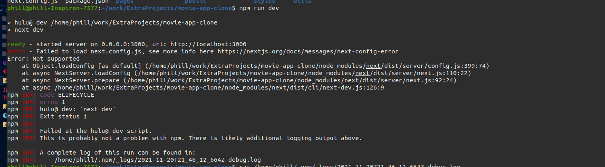

# Deploying to Heroku
* Deploying Hulu app to Heroku

## Steps
* Clone the Repository
* cd into the app directory
* Run command: npm install
*  Create a Proc file and add the line shown below
```
web: npm run start
```
* Follow the remaining steps in this link: [Heroku Deployment](https://mariestarck.com/deploy-your-next-js-app-to-heroku-in-5-minutes/)
* Set Api keys via config vars in Heroku by typing in the command line
```
heroku config:set API_KEY:replace_with_actual_key
```

## Possible Errors and Fixes
* Fix: Update npm to latest version




---
* H10 Error Fix: Ensure Procfile contains the line below:
```
web: npm run start
```


## Logs
* Check logs by running command:
```
heroku logs --tail --app name_of_app
```
